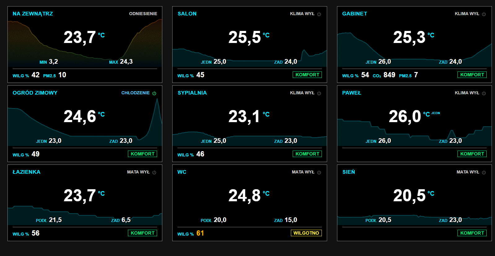

# Avionics Cards

Glass-cockpit inspired dashboard cards for [Home Assistant](https://www.home-assistant.io/).
Black background, thin frames, condensed digits and a strict colour language borrowed
from aircraft avionics: white for values, cyan for set points, magenta for
forecasts, amber for cautions and red for warnings.

> **Status: work in progress (0.x).** Card configuration may still change between versions.

## Cards

| Card | Type | Status |
|---|---|---|
| Avionics Climate | `custom:avionics-climate-card` | available |
| Value tile | — | planned |
| Horizontal gauge (EIS bar) | — | planned |
| Entity list | — | planned |
| Dial gauge | — | planned |
| Bar chart | — | planned |
| Annunciator / alerts | — | planned |

## Installation

### HACS (custom repository)

1. HACS → ⋮ → **Custom repositories**
2. Repository: `https://github.com/<owner>/avionics-cards`, category **Dashboard**
3. Install **Avionics Cards** and reload the browser.

### Manual

1. Download `avionics-cards.js` from the latest [release](../../releases).
2. Copy it to `/config/www/`.
3. Settings → Dashboards → ⋮ → **Resources** → add `/local/avionics-cards.js` as a *JavaScript module*.

## Avionics Climate



Room tile with a background temperature graph, comfort indicator and one-tap control
of an air conditioner or heating mat. Fully configurable in the visual editor.

```yaml
type: custom:avionics-climate-card
name: Living room
temperature_entity: sensor.living_room_temperature
humidity_entity: sensor.living_room_humidity
climate_entity: climate.living_room
co2_entity: sensor.living_room_co2        # optional
pm25_entity: sensor.living_room_pm25      # optional
```

| Option | Default | Description |
|---|---|---|
| `name` | — | Tile title |
| `mode` | `room` | `room` or `outdoor` (reference tile: MIN/MAX of the last 24 h instead of unit/set point) |
| `temperature_entity` | — | Temperature sensor. If missing or unavailable, `current_temperature` of the climate entity is used |
| `humidity_entity` | — | Humidity sensor |
| `climate_entity` | — | Climate entity; tap toggles it, hold opens more-info |
| `co2_entity`, `pm25_entity` | — | Optional air quality sensors |
| `device_label` | `auto` | `auto`, `ac` or `mat` — wording of status/labels |
| `t_min` / `t_max` | `19` / `26` | Cold / hot thresholds [°C] |
| `h_min` / `h_max` | `30` / `60` | Dry / humid thresholds [%] |
| `co2_max` | `1200` | CO₂ threshold [ppm] |
| `pm25_max` | `25` | PM2.5 threshold [µg/m³] |
| `hours_to_show` | `24` | Graph range [h] |
| `px_per_degree` | `12` | Maximum graph height for 1 °C — keeps amplitudes comparable between tiles |
| `graph_style` | `color` | `color` (temperature thresholds) or `mono` |
| `graph_color` | `#00e5ff` | Line colour in `mono` style |

## Theme variables

All cards read optional variables from your Home Assistant theme:

```yaml
My theme:
  avionics-style: "true"   # "true" = strict cockpit colours (white labels, cyan = set points)
                           # "look" = cyan labels (default)
  # optional fine tuning:
  avionics-label-color: "#ffffff"
  avionics-setpoint-color: "#00e5ff"
  avionics-frame-color: "#8c8c8c"
  avionics-font-family: "Roboto Condensed, sans-serif"
```

Run `frontend.reload_themes` after a change — no restart needed.

## Development

```bash
npm ci
npm run build        # dist/avionics-cards.js
npm run watch        # rebuild on change

# copy every build straight to Home Assistant (e.g. a Samba share):
AVIONICS_DEPLOY_DIR=/path/to/ha/config/www npm run watch
```

Releases are built by GitHub Actions when a `vX.Y.Z` tag matching `package.json` is pushed.

## Migrating from `g1000-climate-card`

`custom:g1000-climate-card` is still registered as an alias, the `g1000-style` theme
variable is still read, and `device_label: KLIMA/MATA` is mapped to `ac/mat`.
Remove the old `/local/g1000-climate-card.js` resource after installing this bundle.

## License

MIT
