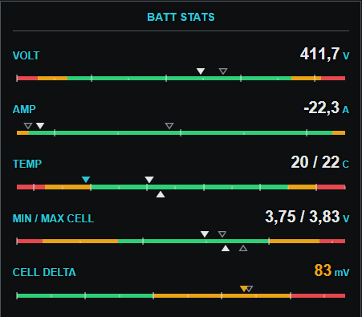
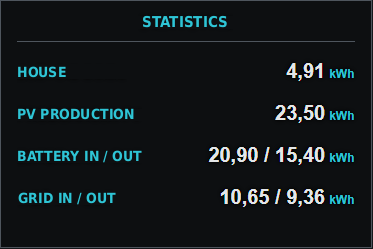
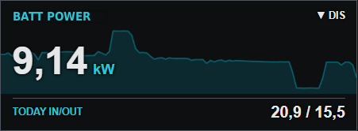
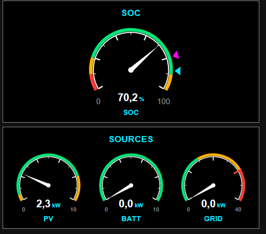
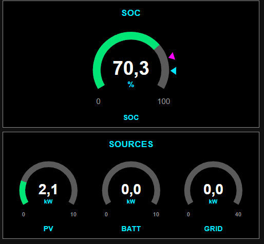
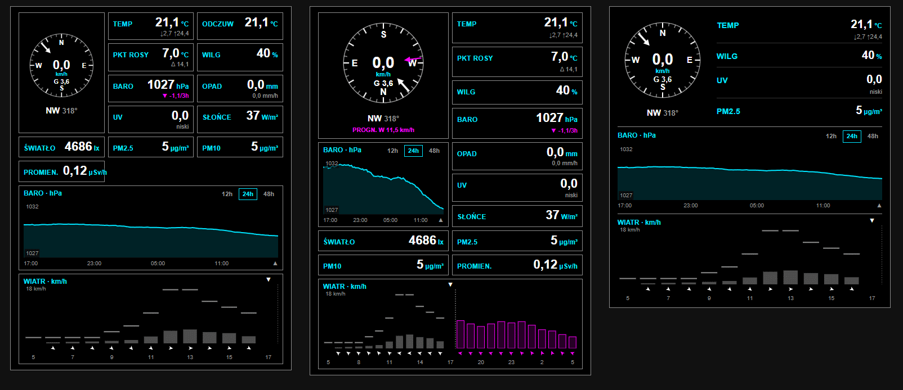
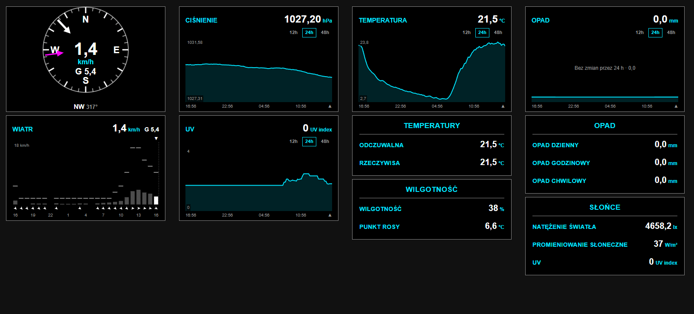

# Avionics Cards

Glass-cockpit inspired dashboard cards for [Home Assistant](https://www.home-assistant.io/).
Black background, thin frames, condensed digits and a strict colour language borrowed
from aircraft avionics: white for values, cyan for set points, magenta for
forecasts, amber for cautions and red for warnings.

> **Status: work in progress (0.x).** Card configuration may still change between versions.

## Cards

| Card | Type | Purpose |
|---|---|---|
| Avionics EIS | `custom:avionics-eis-card` | Engine-indication bars with zones, set points, forecasts and observed values |
| Avionics List | `custom:avionics-list-card` | Compact list of values |
| Avionics Value | `custom:avionics-value-card` | Large value tile with direction status, footer and background graph |
| Avionics Dial | `custom:avionics-dial-card` | Round gauges, single or grouped |
| Avionics Bars | `custom:avionics-bars-card` | Hourly bar chart from a series (energy prices, forecasts) |
| Avionics Weather | `custom:avionics-weather-card` | Ready-made weather station |
| Avionics Wind | `custom:avionics-wind-card` | Wind compass |
| Avionics Wind Graph | `custom:avionics-wind-graph-card` | Hourly wind bars with forecast |
| Avionics Graph | `custom:avionics-graph-card` | History graph with range buttons |
| Avionics Softkeys | `custom:avionics-softkeys-card` | Function buttons with confirmation, active state, set value and progress |
| Avionics Endurance | `custom:avionics-endurance-card` | Fuel computer for an energy storage: endurance and ETA, forecast low, SoC profile |
| Avionics Goal | `custom:avionics-goal-card` | Progress to a goal like a flight, or wear to a limit like engine TBO |
| Avionics Forecast | `custom:avionics-forecast-card` | Hourly forecast from Open-Meteo: cloud layers, fog, precipitation, temperature, pressure, wind, PV |
| Avionics Radar | `custom:avionics-radar-card` | Precipitation radar like NEXRAD on an MFD |
| Avionics METAR | `custom:avionics-metar-card` | METAR for an airport: flight category, raw report, decoded fields |
| Avionics Astro | `custom:avionics-astro-card` | Sun and moon: day profile, twilight, day length, moon phase |
| Avionics Tank | `custom:avionics-tank-card` | Level like a fuel gauge: battery SoC, water, pellets |
| Avionics Cylinders | `custom:avionics-cylinder-card` | Similar values side by side like the LEAN page: cells, rooms, phases |
| Avionics Synoptic | `custom:avionics-synoptic-card` | Electrical synoptic: DC bus, inverter, AC bus, grid contactor |
| Avionics Frame | `custom:avionics-frame-card` | The avionics header and frame around any card |
| Avionics Climate | `custom:avionics-climate-card` | Room tile with background graph and climate / heating-mat control |

## Installation

### HACS (custom repository)

1. HACS → ⋮ → **Custom repositories**
2. Repository: `https://github.com/<owner>/avionics-cards`, category **Dashboard**
3. Install **Avionics Cards** and reload the browser.

### Manual

1. Download `avionics-cards.js` from the latest [release](../../releases).
2. Copy it to `/config/www/`.
3. Settings → Dashboards → ⋮ → **Resources** → add `/local/avionics-cards.js` as a *JavaScript module*.

## Avionics EIS



Engine-indication style rows: label and digital value with a horizontal bar underneath.
Rows are added, removed and reordered in the visual editor. For plain values without
bars use [Avionics List](#avionics-list).

Bar convention (as on twin-engine cockpit gauges):

- **filled pointers = current values** — first entity ▼ above the band, second entity ▲ below;
  each turns amber/red in its own caution/warning zone
- **hollow pointers = observed values** — on the side of their entity, either the min/max over the row's
  `range_minutes`, or where the value was `range_minutes` ago (shows direction and rate of change)
- **cyan pointers = set points** — next to the value they belong to: first above the band, second below
- **magenta pointers = forecasts** — same placement as set points

```yaml
type: custom:avionics-eis-card
title: Battery
entities:
  - entity: sensor.battery_voltage
    name: VOLT
    min: 330
    max: 420
    warning_low: 340
    caution_low: 360
    caution_high: 410
    warning_high: 415
  - entity: sensor.cell_temp_min
    entity2: sensor.cell_temp_max     # second value: pointer below the bar, shown as a / b
    name: TEMP
    min: 0
    max: 50
    caution_high: 35
    warning_high: 45
  - entity: sensor.cell_delta
    name: Δ CELL
    min: 0
    max: 150
    caution_high: 30
    warning_high: 80
    show_range: true
    range_minutes: 30                  # observed window per row, in minutes
    range_markers: max                 # only the worst value matters here
  - entity: sensor.battery_current
    name: AMP
    min: -30
    max: 30
    show_range: true
    range_minutes: 5
    range_markers: ago                 # hollow pointer = where it was 5 min ago
  - entity: sensor.battery_soc
    name: SOC
    warning_low: 10
    caution_low: 20
    show_range: true                  # hollow markers: observed min/max (default 1440 min)
    setpoint_entity: input_number.target_soc
  - entity: sensor.remaining_energy    # list row without bar
    name: REM
    show_bar: false
```

| Row option | Default | Description |
|---|---|---|
| `entity` | — | Numeric entity (required) |
| `name` | friendly name | Row label |
| `unit` | entity unit | Unit override |
| `precision` | entity / state | Decimals |
| `show_bar` | `true` | Draw the EIS bar |
| `min` / `max` | `0` / `100` | Scale range |
| `warning_low`, `caution_low`, `caution_high`, `warning_high` | — | Zone thresholds → red / amber / green bands; pointer and value change colour |
| `setpoint` / `setpoint_entity` | — | Set point of the first value, cyan pointer above the band |
| `setpoint2` / `setpoint2_entity` | — | Set point of the second value, cyan pointer below the band |
| `forecast` / `forecast_entity`, `forecast2` / `forecast2_entity` | — | Forecast of the first / second value, magenta pointer above / below the band |
| `entity2` | — | Second value, filled pointer below the bar (e.g. max cell temperature) |
| `show_range` | `false` | Hollow markers at observed values |
| `range_minutes` | `1440` | Observed period for this row, in minutes |
| `range_markers` | `both` | `both`, `min`, `max` — extremes over the period; `ago` — value one period ago |
| `show_scale` | `false` | Scale numbers under the bar |
| `major_tick` | auto | Major tick step |

Card option: `title`. Unavailable entities are crossed out with a red X.
History is fetched once per entity (longest window) and then extended live, so short
windows stay accurate and several rows of the same entity cost a single query.

## Avionics List



Compact list of values in the same style — label on the left, value on the right.
Numeric values can be coloured by the same zone thresholds as EIS bars; text states
are shown the way Home Assistant formats them.

```yaml
type: custom:avionics-list-card
title: Battery
entities:
  - entity: sensor.battery_remaining_energy
    name: REM
  - entity: sensor.battery_balance_today
    name: BAL TODAY
    show_sign: true                   # +7.4
  - entity: sensor.battery_charged_today
    entity2: sensor.battery_discharged_today
    name: CHG/DSG                     # 12.7/5.3
    separator: true                   # line above
  - entity: sensor.battery_temperature
    name: TEMP
    caution_high: 35
    warning_high: 45
```

| Row option | Default | Description |
|---|---|---|
| `entity` | — | Entity (required) |
| `name` | friendly name | Row label |
| `unit` | entity unit | Unit override |
| `precision` | entity / state | Decimals |
| `show_sign` | `false` | `+` before positive values |
| `separator` | `false` | Line above the row |
| `entity2` | — | Second value, shown as `a / b` |
| `warning_low`, `caution_low`, `caution_high`, `warning_high` | — | Value turns amber / red outside the thresholds |

## Avionics Value



Large value tile: name and direction status on top, big value, footer value under
the rule and an optional background graph (with a dashed zero line for signed values).

```yaml
type: custom:avionics-value-card
name: BAT
entity: sensor.battery_power          # W, positive = charging
multiplier: 0.001                     # W -> kW
unit: kW
abs_value: true                       # direction is shown by the status
status_positive: CHG                  # ▲ green
status_negative: DSG                  # ▼ amber
deadband: 0.05                        # "—" within ±0.05 kW
footer_name: TODAY CHG/DSG
footer_entity: sensor.battery_charged_today
footer_entity2: sensor.battery_discharged_today
```

| Option | Default | Description |
|---|---|---|
| `entity` | — | Main value (required) |
| `name` | friendly name | Tile title |
| `unit`, `precision` | entity | Unit and decimals (2 decimals by default when a multiplier is used) |
| `multiplier` | `1` | Scale the value, e.g. `0.001` for W → kW |
| `abs_value` | `false` | Show the absolute value |
| `show_sign` | `false` | `+` before positive values |
| `status_positive`, `status_negative` | — | Direction labels (▲ / ▼) by the sign of the value |
| `status_zero`, `deadband` | `—`, `0` | Label shown within ±deadband of zero |
| `show_footer` | `true` | `false` hides the rule and footer; the value stays in place |
| `footer_name`, `footer_entity`, `footer_entity2`, `footer_precision` | — | Footer label and value (`a / b` with two entities); the label alone works as a description |
| `caution_*`, `warning_*` | — | Zone thresholds colouring the value |
| `show_graph`, `hours_to_show`, `graph_min_range`, `graph_color` | `true`, `24`, `1`, `#00e5ff` | Background graph; `graph_min_range` keeps noise from looking dramatic |

## Avionics Dial



Round gauges. One dial is a single tile; several dials share one frame with an optional
group title and wrap automatically on narrow screens. Dials are added, removed and
reordered in the visual editor.

Two styles:

- **`trueAvionics`** (default) — cockpit engine gauge: thin scale with ticks, zone bands
  outside the scale, red line at `warning_high`, needle and digital readout that turn
  amber / red in caution / warning zones
- **`simplified`** — thick track filled up to the value, large number in the centre



Markers use the same vocabulary as the EIS card: **cyan** arrow = set point,
**magenta** arrow = forecast (both outside the scale), **hollow** markers = observed values.

```yaml
type: custom:avionics-dial-card
title: Sources
dial_style: trueAvionics
entities:
  - entity: sensor.pv_power
    name: PV
    multiplier: 0.001                 # W -> kW
    unit: kW
    max: 10
    forecast_entity: sensor.pv_forecast_now   # magenta, in displayed units (kW)
    show_range: true
    range_minutes: 60
    range_markers: max                # hollow: max of the last hour
  - entity: sensor.grid_import
    name: IMPORT
    multiplier: 0.001
    unit: kW
    max: 35
    caution_high: 20
    warning_high: 30                  # red line
```

| Card option | Default | Description |
|---|---|---|
| `title` | — | Group title |
| `dial_style` | `trueAvionics` | `trueAvionics` or `simplified` |

| Dial option | Default | Description |
|---|---|---|
| `entity` | — | Entity (required) |
| `name` | friendly name | Label under the dial |
| `unit`, `precision` | entity | Unit and decimals (1 decimal by default when a multiplier is used) |
| `multiplier` | `1` | Scale the value, e.g. `0.001` for W → kW |
| `min` / `max` | `0` / `100` | Scale range |
| `caution_*`, `warning_*` | — | Zone thresholds; `warning_high` also draws the red line |
| `setpoint` / `setpoint_entity` | — | Cyan set-point arrow (displayed units) |
| `forecast` / `forecast_entity` | — | Magenta forecast arrow (displayed units) |
| `show_range`, `range_minutes`, `range_markers` | `false`, `60`, `max` | Hollow markers: `both`, `min`, `max` over the period, or `ago` |

## Avionics Bars

Hourly bar chart from a list in an entity attribute — typically energy prices or
forecasts. Periods shorter than an hour (e.g. 15-minute prices) are averaged per hour.

- current hour highlighted with ▼, past hours dimmed
- tap a bar to read its value in the header, tap again to return to the current hour
- negative values drawn below a zero line
- up to three **cyan threshold lines** (fixed value or entity) with labels
- optional **tariff band** under the bars: listed hours green, others amber
- bars coloured by the usual zone thresholds
- optional **opportunity** colouring: bars green above a threshold (e.g. selling) or below it
  (e.g. charging an EV); caution / warning zones take precedence
- dashed **midnight** line with a small date label (can be turned off)

```yaml
type: custom:avionics-bars-card
name: Sell price
entity: sensor.rce_pse_price
entity_next: sensor.rce_pse_price_tomorrow   # optional: rest of the series in another entity
preset: pse_rce                       # pse_rce, nordpool, entsoe or custom
multiplier: 0.001                     # PLN/MWh -> PLN/kWh
offset: 0                             # e.g. 0.08 margin of a dynamic tariff
final_multiplier: 1.23                # VAT
unit: PLN/kWh
hours_back: 2
hours_forward: 22
line1: 0.64
line1_label: OFFPEAK
line2_entity: sensor.sell_threshold
line2_label: THRESHOLD
line3: 1.19
line3_label: PEAK
band_hours: 22-6, 13-15               # cheaper tariff hours
good_direction: above                 # green bars = worth selling
good_entity: sensor.sell_threshold
```

| Option | Default | Description |
|---|---|---|
| `entity` | — | Entity holding the series (required) |
| `entity_next` | — | Optional entity with the rest of the series (same layout), e.g. tomorrow's prices |
| `preset` | `pse_rce` | Known attribute layouts: `pse_rce`, `nordpool`, `entsoe`, or `custom` |
| `attribute`, `time_field`, `value_field`, `time_is_end` | — | For `custom`: attribute(s) with the list (comma separated), field names, and whether the time marks the end of a period |
| `hours_back` / `hours_forward` | `2` / `22` | Window around the current hour |
| `multiplier`, `offset`, `final_multiplier` | `1`, `0`, `1` | Value = (raw × `multiplier` + `offset`) × `final_multiplier` — e.g. (spot price + margin) × VAT; the editor shows the resulting formula |
| `unit`, `precision` | entity, auto | Display |
| `lineN`, `lineN_entity`, `lineN_label` (N = 1–3) | — | Threshold lines |
| `band_hours` | — | Hours shown green in the tariff band, e.g. `22-6, 13-15` |
| `good_direction` | `off` | `above` or `below`: bars green on that side of the threshold |
| `good_value` / `good_entity` | — | Opportunity threshold (displayed units) |
| `show_midnight` | `true` | Dashed line between 23:00 and 0:00 |
| `caution_*`, `warning_*` | — | Zone thresholds colouring the bars |

## Avionics Weather



A ready-made weather station card for people who just want their station on a dashboard.
Pick the station **device** and the card finds the sensors itself — outdoor (not indoor)
temperature, relative (not absolute) pressure, current gust (not the daily maximum),
daily rain (not weekly) and so on. Anything that is not available is simply not shown.

- **wind** as an HSI-style compass rose with speed and gust in the centre and the direction as
  `WNW 292°` (always where the wind comes from); the arrow shows where the wind comes **from**
  (meteorological, default) or blows **to**; the rose can be **rotated** so the
  direction you choose is at the top (e.g. a station display hung on an east-facing wall);
  hidden when there is no wind data; when the station has its own wind sensors, wind from the
  `weather.*` entity is shown as a **magenta forecast** arrow with `FCST WSW 9.0 km/h` below
- **temperature** with today's min / max
- **pressure** with a magenta trend arrow and change over 3 h; a fast fall (≥ 3 hPa / 3 h) turns amber
- **humidity**, **UV** with WHO category, **rain** today and current rate
- **dew point** with temperature spread — amber "fog risk" below 2.5 °C (as in aviation METARs)
- **feels like**, **solar radiation**, **illuminance**
- **PM2.5 / PM10** (amber above 25 / 50 µg/m³, red above 50 / 100) and **ionising radiation**
  (amber above 0.3 µSv/h, red above 1 µSv/h)
- any **additional sensors** as extra items
- **order and visibility** of all values set in the editor (↑ ↓ and show / hide), including
  auto-detected sensors
- optional **wind graph** — hourly bars: measured average with gust tick and direction arrow for past
  hours, hourly **forecast** in magenta outline for the next hours (from any `weather.*` entity, units
  converted), caution / warning thresholds colour bars and gusts — useful for paragliding, kiting,
  wind turbines
- optional **pressure graph** at the bottom with 12 / 24 / 48 h buttons, fixed or fitted scale
  and a dashed 1013 hPa reference line

Two layouts: **list** (compass next to a list of values) and **boxes** — every value in its own
frame, label and value on one line, in 1–4 columns; the compass takes a tall box in the first column.

Value sources, in order: sensors set in the card → sensors detected on the device →
attributes of a `weather.*` entity (fills gaps, e.g. UV from a forecast service).
The editor shows which sensor is used for each value and what is skipped.

```yaml
type: custom:avionics-weather-card
name: Weather
device: 0123456789abcdef          # weather station device (picked in the editor)
weather_entity: weather.home      # optional fallback
layout: boxes                     # list or boxes
columns: 2
pm25: sensor.airly_pm25           # sensors from other devices
extra:
  - sensor.lightning_counter
```

| Option | Description |
|---|---|
| `device` | Weather station device — sensors detected automatically |
| `weather_entity` | `weather.*` entity used for values without a sensor |
| `temperature`, `humidity`, `pressure`, `uv`, `wind_speed`, `wind_direction`, `wind_gust`, `rain_rate`, `rain_today`, `feels_like`, `dew_point`, `solar`, `illuminance`, `pm25`, `pm10`, `radiation` | Override detected sensors |
| `extra` | Additional sensors shown as extra items |
| `layout`, `columns` | `list` (default) or `boxes`; number of box columns (default `2`, `0` = as many as fit) |
| `pressure_trend_hours` | Pressure trend period, default `3` |
| `wind_arrow` | `from` (default) or `to` |
| `wind_forecast` | Forecast wind from `weather_entity` on the rose (default `true`) |
| `order` | Item order: field keys (`temperature`, `pressure`, `rain`, …) or entity ids of `extra` sensors; items not listed follow in default order |
| `hidden` | Items to hide, same keys as `order` |
| `rotation` | Direction shown at the top of the rose, degrees (default `0` = north) |
| `pressure_graph`, `pressure_graph_scale`, `pressure_graph_span`, `pressure_graph_ranges`, `pressure_graph_reference` | Pressure graph: on/off, `fixed` (default) or `auto`, height in hPa (default `20`), range buttons (default `12, 24, 48`), 1013 hPa line (default on) |
| `wind_graph`, `wind_graph_position` | Wind bars on/off; position like the pressure graph (`auto`, `under_wind`, `bottom`) |
| `wind_forecast_entity` | `weather.*` entity for the hourly wind forecast (default: `weather_entity`) |
| `wind_graph_hours_back`, `wind_graph_hours_forward` | Measured / forecast hours, default `12` / `12` |
| `wind_caution`, `wind_warning` | Wind thresholds in station units (e.g. `25` / `35` km/h) |
| `graph_order` | `pressure_first` (default) or `wind_first` — order when both graphs are in the same place |
| `pressure_graph_position` | Boxes layout: `auto` (default — under the compass on cards wider than ~640 px, otherwise at the bottom), `under_wind` or `bottom`; on narrow cards the graph always moves to the bottom and the grid drops to 2 columns |

## Avionics Wind and Avionics Wind Graph



The compass and the wind bars from the weather card as separate cards, for building your own
dashboard (the screenshot combines them with Avionics Graph and Avionics List). Pick the station **device** (wind sensors are detected automatically) or set the
sensors; both cards share the arrow and rotation options so they stay consistent side by side.

```yaml
type: custom:avionics-wind-card
device: 0123456789abcdef            # or wind_speed / wind_direction / wind_gust
forecast_entity: weather.open_meteo # optional, magenta forecast arrow
wind_arrow: from                    # from (default) or to
rotation: 0
```

```yaml
type: custom:avionics-wind-graph-card
device: 0123456789abcdef
forecast_entity: weather.open_meteo # hourly forecast bars in magenta
hours_back: 12
hours_forward: 12
wind_caution: 25
wind_warning: 35
```

| Option | Cards | Description |
|---|---|---|
| `name` | both | Title |
| `device` / `wind_speed`, `wind_direction`, `wind_gust` | both | Station device or explicit sensors |
| `forecast_entity` | both | `weather.*` entity with the wind forecast |
| `wind_arrow`, `rotation` | both | Arrow convention and direction at the top |
| `hours_back`, `hours_forward` | graph | Measured / forecast hours (default `12` / `12`) |
| `wind_caution`, `wind_warning` | graph | Thresholds in station units |

## Avionics Graph

History graph of a single entity with range buttons on the card itself.

- **fit to height** — any change fills the graph (good for spotting small variations)
- **fixed height** — the graph always spans `span` units (e.g. 20 hPa), so a 2 hPa wave looks
  like 2 hPa; the scale only widens when the data does not fit
- optional dashed reference line (e.g. 1013 hPa), min / max values on the left, times below
- mono or **temperature-scale** colouring
- a series without changes is drawn at the bottom with a "no change" note

```yaml
type: custom:avionics-graph-card
entity: sensor.relative_pressure
ranges: 12, 24, 48
default_range: 24
scale: fixed
span: 20
reference: 1013.25
reference_label: "1013"
```

| Option | Default | Description |
|---|---|---|
| `entity`, `name` | — | Entity and title |
| `ranges`, `default_range` | `12, 24, 48`, `24` | Range buttons and the initial range, hours |
| `scale`, `span` | `auto`, `20` | `auto` or `fixed`; graph height in units for `fixed` |
| `reference`, `reference_label` | — | Dashed reference line |
| `graph_style` | `mono` | `mono` or `temperature` — line coloured along the temperature scale (blue → green → yellow → red), as in Avionics Climate |
| `grid`, `grid_step` | `nice` | Grid lines — see *Grid* below |
| `y_min`, `y_max` | — | Fixed axis range (e.g. a boiler 0–100 °C); widened only when the data goes outside |
| `unit`, `precision`, `multiplier`, `color` | entity, entity, `1`, `#00e5ff` | Display options |

## Avionics Softkeys

Function buttons styled after cockpit controls. One button is a single tile; several share one
frame with an optional title, as a list of tiles or a row of keys. Two button styles:

- **lamp** (default) — like autopilot mode keys: a lamp (bar on the left of a tile, above the label
  of a key) and the label turn **green** while the function is active
- **inverse** — header strip that turns **cyan inverse** while active

The value being set is **cyan**; progress is an EIS-style bar read like a flight plan.

- **action** — any standard Home Assistant action (script, service, toggle, navigate…) with the
  standard **confirmation**, edited with the usual action editor
- **active state** — entity and state, or a template that is true, mean "running" (green lamp);
  label, description and action can differ while active (e.g. *Buy energy* → *Buying*, tap = stop)
- **armed state** — waiting / about to start (white lamp), like armed autopilot modes; entity and
  state or a template
- **hold action** — e.g. a secondary toggle, with the standard confirmation
- **set value** — `input_number` / `number` with − / + buttons (step, min and max from the entity)
- **progress** — EIS-style bar on an absolute scale (default 0–100): the white pointer (current)
  moves towards the cyan target; the travelled part (from the hollow start marker) is grey and the
  remaining way to the target is **magenta**, like the active leg of a flight plan — works in both
  directions (charging up, discharging down)
- **labels and descriptions** — plain text or Jinja templates, rendered by Home Assistant

```yaml
type: custom:avionics-softkeys-card
title: Actions
entities:
  - name: Buy energy
    secondary: "{{ states('input_number.buy_kwh') | int }} kWh"
    tap_action:
      action: perform-action
      perform_action: script.buy_energy
      confirmation:
        text: Start buying?
    value_entity: input_number.buy_kwh
    active_entity: input_boolean.buy_active
    active_name: Buying
    active_secondary: "{{ states('sensor.battery_soc') }} % → {{ states('input_number.buy_target_soc') }} %"
    active_tap_action:
      action: perform-action
      perform_action: script.stop_buying
      confirmation:
        text: Stop?
    progress_start: input_number.buy_start_soc
    progress_current: sensor.battery_soc
    progress_target: input_number.buy_target_soc
```

| Button option | Description |
|---|---|
| `name`, `icon`, `secondary` | Label, optional icon, description (text or template) |
| `tap_action`, `hold_action` | Action on tap (idle) and on hold (any state) |
| `active_entity`, `active_state` / `active_template` | Active when the entity is in this state (default `on`) or the template is true |
| `active_color` | `ok` (green, default), `caution` (amber — e.g. a system paused) or `warning` (red) |
| `armed_entity`, `armed_state` / `armed_template` | Armed (waiting) — white lamp; ignored while active |
| `active_name`, `active_secondary`, `active_tap_action` | Label, description and action while active |
| `value_entity` | `input_number` / `number` set with − / + |
| `progress_current`, `progress_target`, `progress_start` | Progress while active: current (white), target (cyan), start (hollow, optional) — entities or numbers |
| `progress_min`, `progress_max` | Scale of the progress bar, default `0` / `100` |

Card options: `title`, `layout` (`list` or `row`), `key_style` (`lamp` or `inverse`).

## Avionics Endurance

A fuel computer for a home battery — the energy storage is the fuel tank:

- **ENDUR** (time to empty) and **ETA** (clock time) for two scenarios: *without PV* (current
  consumption; amber / red when short) and *with the PV forecast* (magenta, it is a forecast) —
  or "will not deplete" with the forecast low and the SoC after PV charging
- **SoC gauge** like a fuel gauge: white pointer now, magenta hollow marker at the forecast low,
  magenta marker at the SoC after PV, red / amber zones at the bottom of the scale
- optional **SoC profile** — the forecast SoC as a dashed magenta line, like a vertical profile
- ETA is counted from the time the forecast was calculated (`updated` attribute)

Values come from attributes of one forecast entity; names are configurable.

```yaml
type: custom:avionics-endurance-card
name: Battery
entity: sensor.battery_forecast
endurance_attribute: autonomy_nopv_h     # hours, null = more than max_hours
endurance_pv_attribute: autonomy_pv_h    # hours, null = will not deplete
soc_attribute: soc_now                   # or soc_entity: sensor.battery_soc
min_attribute: min_soc_predicted
min_hour_attribute: min_soc_hour
rebound_attribute: rebound_soc
updated_attribute: updated
trajectory_attribute: soc_trajectory     # list of numbers or of objects with "soc"
max_hours: 36
caution_hours: 6
warning_hours: 3
```

| Option | Default | Description |
|---|---|---|
| `entity` | — | Forecast entity (required) |
| `*_attribute`, `soc_entity` | see above | Where the values are |
| `label_nopv`, `label_pv` | `ENDUR · NO PV`, `ENDUR · WITH PV` | Scenario labels |
| `max_hours`, `caution_hours`, `warning_hours` | `36`, `6`, `3` | "> N h" above; amber / red below |
| `soc_warning`, `soc_caution` | `10`, `20` | Gauge zones |
| `show_profile`, `profile_hours` | `true`, `24` | SoC profile |

## Avionics Goal

Rows of two kinds:

- **goal** — read like a flight to a destination: travelled part grey, remaining way magenta,
  **DIS** (left to go), **GS** (rate per day), **ETE** and **ETA**; after the goal is reached a
  green *REACHED ✓* badge appears, the bar starts again (100 % is the new zero) and the full value
  stays visible, e.g. *9840 / 8000 · 123 %*
- goal rows can also aim further, like a flight plan with waypoints (only the active leg — to the
  next waypoint — is magenta, later legs are white): **given profit** (e.g. 150 %) or
  **end of cycle life** — the end is forecast from the limit row in the same card (cycles left at the
  current cycle rate) and the current profit rate; waypoints (e.g. 100, 150, 200 %) are shown up to
  the end of life with a flight-plan list (amount, ETE, ETA); a target beyond the end of life is
  marked as such; optional capacity at end of life (default 100 % = no correction) lowers the profit
  rate linearly with the cycles used
- **limit** — wear to a limit like engine time to TBO: used part, amber / red zones near the limit,
  remaining %, and when the limit will be reached; above 100 % the bar turns red with *EXCEEDED*

Current value, goal and rate can come from an entity, an attribute or a template; the rate can
also be computed from a start date (value / days). The marker sits at the goal, at your own point
(e.g. a forecast for a date — magenta, or a set point — cyan) or can be turned off.

```yaml
type: custom:avionics-goal-card
title: Economy
entities:
  - name: Cycle life
    kind: limit
    current_template: "{{ states('sensor.battery_discharged_total') | float(0) / 40 }}"
    target: 2000
    start_date: "2026-03-01"
    precision: 0
  - name: Payback
    kind: goal
    current_entity: sensor.battery_profit_total
    target: 8000
    unit: zł
    precision: 2
    start_date: "2026-03-01"
```

| Row option | Description |
|---|---|
| `name`, `kind` | Label; `goal` (default) or `limit` |
| `current_entity` + `current_attribute` / `current_template` | Current value |
| `target` / `target_entity` / `target_template`, `start` | Goal or limit; scale start (default `0`) |
| `start_date` / `rate_entity` / `rate_template` | Rate per day (GS) |
| `marker`, `marker_value` / `marker_entity` / `marker_template`, `marker_color` | `target` (default), `custom` or `off`; colour `forecast` (magenta, default) or `setpoint` (cyan) |
| `caution_pct`, `warning_pct` | Limit zones, default `80` / `95` % |
| `projection` | `payback` (default, unchanged), `target_pct` or `end_of_life` |
| `target_pct`, `waypoints` | Given profit in % of the goal (default `150`); waypoints in % (default `100, 150, 200, 250, 300`) |
| `eol_capacity`, `life_row` | Capacity at end of life in % (default `100`); name of the cycle-life row (default: first limit row) |
| `unit`, `precision` | Display |

## Avionics Forecast

Hourly forecast fetched directly from [Open-Meteo](https://open-meteo.com) for the home location
(no API key). Rows are ordered from the sky to the ground and each can be turned off:

- **cloud layers** high / mid / low and **fog** (BR mist < 5 km, FG fog < 1 km) as cells; legend in
  **oktas** (FEW / SCT / BKN / OVC) or percent
- **precipitation** bars coloured like a weather radar (light green, moderate yellow, heavy red), brightness =
  probability; *no precipitation in the forecast* when there is none; probability row
- **temperature** and **pressure** lines with the grid
- **wind** with direction arrows and **gusts** (amber / red from thresholds); knots, km/h, m/s or mph
- **PV** (optional) — calculated from irradiance on the panel plane (power, tilt, azimuth, efficiency)
  or taken from an integration (Solcast, Open-Meteo Solar Forecast, custom attribute); daily sums

The number of labels follows the card width (every hour on a wide card, every 2–4 hours in a column).
Range buttons (*N h*, *tomorrow*, *48 h*) can be hidden; `offset_hours` lets two cards side by side
show e.g. 0–12 h and 12–24 h.

```yaml
type: custom:avionics-forecast-card
hours: 36
wind_unit: kn
cloud_mode: okta
show_pv: true
pv_source: calculated
pv_kwp: 9.6
pv_tilt: 35
pv_azimuth: 0
```

| Option | Default | Description |
|---|---|---|
| `view`, `hours`, `offset_hours`, `show_buttons` | `next`, `36`, `0`, `true` | Window: from now (+ offset) or `tomorrow` |
| `show_clouds`, `show_fog`, `show_precip`, `show_temperature`, `show_pressure`, `show_wind`, `show_pv` | all on, PV off | Rows |
| `size` | `auto` | `compact`, `normal`, `large` — fonts and graph heights; `auto` follows the card width |
| `cloud_mode` | `okta` | `okta` or `percent` |
| `wind_unit`, `gust_caution`, `gust_warning` | `kn`, 25 / 35 kt | Wind unit and gust thresholds (defaults follow the unit) |
| `pv_source` | `calculated` | `calculated` (`pv_kwp`, `pv_tilt`, `pv_azimuth`, `pv_efficiency`) or `entity` (`pv_entity`, `pv_preset`: `solcast`, `open_meteo_solar`, `custom` with `pv_attribute`, `pv_time_field`, `pv_value_field`, `pv_multiplier`) |
| `latitude`, `longitude` | home | Location |

## Avionics Radar

Precipitation radar in the style of the NEXRAD overlay on a cockpit MFD: black background with a
vector map like an MFD (borders, coastlines, rivers, lakes and cities from Natural Earth, drawn over
the radar so they stay visible), home in
the centre with dashed range rings (km or NM) and a north marker, animation of the last ~2 hours.

The free [RainViewer](https://www.rainviewer.com/api.html) API offers only one palette (Universal
Blue), zoom up to 7 and past frames. The card therefore **decodes the radar reflectivity (dBZ)** from
the Universal Blue colours in the browser, **interpolates the dBZ field** for higher zoom levels
(smooth contours, no mixed colours) and paints it with the cockpit palette: green from 15 dBZ (light),
yellow from 30 (moderate), red from 40 (heavy), magenta from 50 (very heavy). Below the map: distance
and direction to the nearest echo, moderate and heavy precipitation.

Drag to move the map, + / − to zoom, ⌂ to return home. City labels never overlap: larger cities
first, about one label per 10 000 px² of map. The radar data level follows the zoom, so a wide view
needs only a few tiles per frame.

If the tile server does not allow reading pixels in the browser, the card falls back to the original
RainViewer colours and says so on the map.

```yaml
type: custom:avionics-radar-card
zoom: 8
height: 320
rings: 25, 50, 100
distance_unit: km
```

| Option | Default | Description |
|---|---|---|
| `zoom`, `height` | `8`, `320` | Map zoom (radar field interpolated above 8) and height in px |
| `rings`, `distance_unit` | `25, 50, 100`, `km` | Range rings; `km` or `nm` |
| `show_distances` | `true` | Distance to the nearest precipitation |
| `style`, `opacity`, `map_brightness` | `g1000`, `0.85`, `0.8` | `g1000` (recoloured by dBZ) or `orig`; radar opacity; map brightness |
| `basemap` | `vector` | `vector` (MFD-style vector map), `esri_dark`, `osm` (darkened), `custom` (`basemap_url` with `{z}` `{x}` `{y}`) or `none` |
| `vector_url` | `data/europe.json` in this repository | Vector map file; can be served from Home Assistant, e.g. `/local/europe.json` |
| `autoplay`, `frame_ms` | `true`, `600` | Animation |
| `latitude`, `longitude` | home | Centre |

## Avionics METAR

Current METAR for an airport from [aviationweather.gov](https://aviationweather.gov/data/api/), decoded
in the card: flight category badge (VFR green, MVFR blue, IFR red, LIFR magenta), observation time in
UTC with age (amber after 60 min, red after 120 min), the raw report, and decoded wind (gusts,
variable direction), visibility, clouds, ceiling (lowest BKN / OVC / VV), temperature / dew point,
QNH (also converted from inches) and weather. The raw METAR can also come from an entity (state or
attribute).

```yaml
type: custom:avionics-metar-card
station: EPKK
```

| Option | Default | Description |
|---|---|---|
| `station` | — | ICAO code |
| `source` | `api` | `api` (aviationweather.gov, refreshed every 10 min) or `entity` |
| `entity`, `attribute` | — | Entity with the raw METAR (state, or the given attribute) |
| `show_raw` | `true` | Show the raw report |

If the browser may not query aviationweather.gov directly (CORS), let Home Assistant fetch the report
with a REST sensor and use `source: entity`:

```yaml
# configuration.yaml
rest:
  - resource: https://aviationweather.gov/api/data/metar?ids=EPKK&format=raw
    scan_interval: 600
    sensor:
      - name: METAR EPKK
        value_template: "{{ value | trim | truncate(255, true, '') }}"
```

```yaml
type: custom:avionics-metar-card
station: EPKK
source: entity
entity: sensor.metar_epkk
```

## Avionics Astro

Sun and moon computed in the card from the home location (SunCalc formulas — no extra entities):

- **day profile** — background by time of day (civil twilight, nautical twilight, night), the
  sun's altitude over 24 h (white) and the moon's own altitude (pale dashed — it is the real moon
  path, not the sun's), *now* line with the sun and a moon phase icon, sunrise ▲ and sunset ▼ times
- values are **computed** (like the `sun.sun` integration, which also computes them) and agree with
  it to the minute; the card computes them itself because `sun.sun` only offers the *next* events
- **sun** — rise / set, civil dawn / dusk (the night boundary for VFR flying, and a good time for
  lights and blinds), solar noon, day length with the change from yesterday, current elevation /
  azimuth
- **moon** — phase drawing and name, illuminated %, rise / set, next full and new moon

```yaml
type: custom:avionics-astro-card
```

| Option | Default | Description |
|---|---|---|
| `show_profile`, `show_sun`, `show_moon` | `true` | Sections |
| `latitude`, `longitude` | home | Location |

## Avionics Tank

A level shown like a fuel quantity gauge — battery state of charge, a water tank, pellets. Large
value (amber / red in the reserve zones), a horizontal bar or a vertical tank (`auto` picks by the
tile shape), the target as a cyan mark while buying / selling, and two values: **stock** and **time** —
*to target* while a target is active, *to full* while charging, otherwise **ENDUR** (from a forecast
entity / attribute, or stock / current power). In the vertical layout the two values sit side by side
and move one under the other when there is not enough room.

Zones work both ways. A battery or a heating-oil tank needs the **low** zones (reserve); a
**rainwater tank** or a waste tank needs the **high** ones — red when full, not when empty:

```yaml
type: custom:avionics-tank-card
name: Rainwater
entity: sensor.rainwater_level
warning_low: 0          # no low zones
caution_low: 0
caution_high: 85
warning_high: 95
```

```yaml
type: custom:avionics-tank-card
entity: sensor.battery_soc
stock_entity: sensor.battery_remaining_wh
stock_multiplier: 0.001        # Wh -> kWh
capacity: 40
power_entity: sensor.battery_power
power_multiplier: 0.001
status_positive: CHG
status_negative: DSG
target_entity: input_number.buy_target_soc
target_active_entity: input_boolean.buy_active
endurance_entity: sensor.battery_forecast
endurance_attribute: autonomy_nopv_h
```

| Option | Default | Description |
|---|---|---|
| `entity`, `name`, `precision` | —, `SOC`, `1` | Level in %, title, decimals |
| `layout` | `auto` | `auto`, `horizontal` or `vertical` |
| `warning_low`, `caution_low` | `10`, `20` | Low zones — red / amber below (`0` = no zone) |
| `caution_high`, `warning_high` | — | High zones — amber / red above, drawn at the full end |
| `stock_entity`, `stock_multiplier`, `capacity`, `stock_unit` | —, `1`, —, `kWh` | Stock from an entity, or level × capacity |
| `power_entity`, `power_multiplier`, `power_unit`, `status_positive`, `status_negative`, `deadband` | — | Power and direction in the header |
| `target_entity` / `target`, `target_active_entity`, `target2_entity`, `target2_active_entity` | — | Target shown while its active entity is `on` |
| `endurance_entity`, `endurance_attribute`, `caution_hours`, `warning_hours` | —, —, `6`, `3` | ENDUR source and thresholds |

## Avionics Cylinders

Similar values side by side, like the cylinder bars on the G1000 LEAN page: battery cells or
modules, room temperatures, inverter phases, PV strings. A common scale (zoomed to the data when
`min` / `max` are not set — cell voltages differ by millivolts), shared zones, an optional red limit
line, the lowest / highest element highlighted in cyan, an optional marker of the maximum or minimum
since midnight above each bar, and a header with MIN, MAX and Δ, average or sum. With many bars only
the highlighted value is shown under them.

```yaml
type: custom:avionics-cylinder-card
title: Battery · modules
entities: [sensor.module_1_min, sensor.module_2_min, sensor.module_3_min]
labels: 1, 2, 3
precision: 3
highlight: min
delta_multiplier: 1000   # Δ in mV
delta_unit: mV
warning_low: 3.0
caution_low: 3.2
```

| Option | Default | Description |
|---|---|---|
| `entities`, `labels` | — | One bar per entity; short labels, comma separated (or `name` per entity) |
| `unit`, `precision`, `multiplier` | — | Display |
| `highlight` | `min` | `min`, `max`, `both` or `none` |
| `peak` | `off` | `max` / `min` since midnight as a hollow marker |
| `summary`, `delta_multiplier`, `delta_unit`, `delta_precision` | `delta` | Third header field: `delta`, `avg` or `sum` |
| `show_values` | `auto` | `auto` (when they fit), `all`, `highlighted` |
| `min`, `max`, `limit` | — | Scale and red limit line |
| zones, `zones_from_entities`, `warning_inverse` | — | As in the other cards |

## Avionics Synoptic

An electrical synoptic like the system pages of the G3000: a **DC bus** (PV strings, battery), the
**inverter** as its own block (AC power, temperature, conversion loss), an **AC bus** (house, grid,
EV) and the grid connected through a **contactor**. Energised lines are green with a direction arrow
and get thicker with power; lines without flow are grey and dashed. Battery charging is green,
discharging white (normal operation, not a caution). When the grid is gone the contactor opens, the grid box is crossed out in red,
the inverter is marked **EPS** and, if configured, the endurance appears below.

Each node has a kind (`source`, `storage`, `load`, `grid`) and a bus (`dc` or `ac`), so the same
card describes a hybrid inverter (battery on DC), an AC-coupled battery, micro-inverters (PV on AC)
or a system without a battery. Visual editor (list of nodes) or YAML.

```yaml
type: custom:avionics-synoptic-card
title: Electrical
inverter:
  model: Hybrid · DC/AC
  entity: sensor.inverter_ac_power      # + DC -> AC
  multiplier: 0.001
  temp_entity: sensor.inverter_temperature
endurance_entity: sensor.battery_forecast
endurance_attribute: autonomy_nopv_h
nodes:
  - { name: PV1, kind: source, entity: sensor.pv1_power, multiplier: 0.001 }
  - { name: PV2, kind: source, entity: sensor.pv2_power, multiplier: 0.001 }
  - { name: BATTERY, kind: storage, entity: sensor.battery_power, multiplier: 0.001, soc_entity: sensor.battery_soc }
  - { name: GRID, kind: grid, entity: sensor.grid_power, multiplier: 0.001, connected_entity: binary_sensor.grid_available }
  - { name: HOUSE, kind: load, entity: sensor.house_power, multiplier: 0.001 }
  - { name: EV, kind: load, entity: sensor.ev_charger_power, multiplier: 0.001, available_entity: binary_sensor.ev_connected }
```

| Node option | Description |
|---|---|
| `name`, `kind`, `bus` | Label; `source` / `storage` / `load` / `grid`; `dc` / `ac` (default: with an inverter sources and storage on DC, the rest on AC) |
| `entity`, `multiplier`, `invert` | Power with sign: + production / charging / consumption / import; `invert` flips it |
| `entity_negative` | Separate entity for the other direction when the integration splits it (grid: export, storage: discharge) — power = `entity` − `entity_negative` |
| `soc_entity` | Storage: state of charge |
| `available_entity` | Load: `off` / `unavailable` = disconnected |
| `connected_entity`, `connected_state` | Grid: present when the entity is in this state (default `on`) |

Node options for sources and storage: `voltage_entity`, `current_entity` — a small line under the value
(e.g. PV string voltage and current).

Card options: `inverter` (`name`, `model`, `entity`, `multiplier`, `temp_entity`, `status_entity`,
`efficiency_entity`), `pv_power_entity` / `pv_energy_entity` (PV total above the DC bus),
`dc_voltage_entity` / `dc_current_entity` / `dc_power_entity` (under the DC bus), `ac_voltage_entities` /
`ac_current_entities` / `ac_power_entities` (phases L1–L3 under the AC bus; powers converted from W or
kW to the card unit), `unit` (`kW`),
`deadband`, `status_positive` / `status_negative`, `endurance_entity` / `endurance_attribute`.

## Avionics Frame

The avionics header and frame around **any** card — e.g. Sankey Chart, an entities card or a history
graph — so it looks like the rest of the set without card-mod. The inner card's own background,
border and shadow are switched off with theme variables; remove its own title and put the title in
the frame. The inner card is edited as YAML in the frame's editor.

```yaml
type: custom:avionics-frame-card
title: Power flow
card:
  type: custom:sankey-chart
  sections: [...]
```

| Option | Default | Description |
|---|---|---|
| `title` | — | Header |
| `card` | — | The card inside |
| `padding` | `false` | Inner margin around the card |

## Visually compatible cards

### Sankey Chart

[Sankey Chart](https://github.com/MindFreeze/ha-sankey-chart) shows *where* the energy goes, which
complements the synoptic (*how* it flows right now). It has a colour per box, and the frame,
background and font can be set with [card-mod](https://github.com/thomasloven/lovelace-card-mod).

**Energy palette.** In a Sankey the colour carries the *energy carrier*, not a state, so it is a
deliberate exception to the avionics colours: one colour per source, the same in both directions.
PV pure yellow `#ffe600` (clearly different from the caution amber), battery green `#00e676` (charge
and discharge), grid in the supplier's colour (e.g. `#e2007a`, import and export), house
consumption white, individual loads grey:

```yaml
type: custom:sankey-chart
show_names: true
sections:
  - entities:
      - { entity_id: sensor.grid_import, color: "#e2007a", children: [sensor.house_power, sensor.battery_charge] }
      - { entity_id: sensor.pv1_power, color: "#ffe600", children: [sensor.house_power, sensor.grid_export, sensor.battery_charge] }
      - { entity_id: sensor.battery_discharge, color: "#00e676", children: [sensor.house_power, sensor.grid_export] }
  - entities:
      - { entity_id: sensor.house_power, color: "#ffffff", children: [sensor.fridge_power, sensor.computer_power] }
      - { entity_id: sensor.grid_export, color: "#e2007a" }
      - { entity_id: sensor.battery_charge, color: "#00e676" }
  - entities: [sensor.fridge_power, sensor.computer_power]
card_mod:
  style: |
    ha-card {
      background: #000;
      border: 1.5px solid #8c8c8c;
      border-radius: 0;
      font-family: var(--avionics-font-family, 'Roboto Condensed', 'Arial Narrow', sans-serif);
      --primary-color: #5a5a5a;
      --primary-text-color: #ffffff;
      --secondary-text-color: #9a9a9a;
    }
```

## Avionics Climate


Room tile with a background temperature graph, comfort indicator and one-tap control
of an air conditioner or heating mat. Fully configurable in the visual editor.

```yaml
type: custom:avionics-climate-card
name: Living room
temperature_entity: sensor.living_room_temperature
humidity_entity: sensor.living_room_humidity
climate_entity: climate.living_room
co2_entity: sensor.living_room_co2        # optional
pm25_entity: sensor.living_room_pm25      # optional
```

| Option | Default | Description |
|---|---|---|
| `name` | — | Tile title |
| `mode` | `room` | `room` or `outdoor` (reference tile: MIN/MAX of the last 24 h instead of unit/set point) |
| `temperature_entity` | — | Temperature sensor. If missing or unavailable, `current_temperature` of the climate entity is used |
| `humidity_entity` | — | Humidity sensor |
| `climate_entity` | — | Climate entity; tap toggles it, hold opens more-info |
| `co2_entity`, `pm25_entity` | — | Optional air quality sensors |
| `device_label` | `auto` | `auto`, `ac` or `mat` — wording of status/labels |
| `t_min` / `t_max` | `19` / `26` | Cold / hot thresholds [°C] |
| `h_min` / `h_max` | `30` / `60` | Dry / humid thresholds [%] |
| `co2_max` | `1200` | CO₂ threshold [ppm] |
| `pm25_max` | `25` | PM2.5 threshold [µg/m³] |
| `hours_to_show` | `24` | Graph range [h] |
| `px_per_degree` | `12` | Maximum graph height for 1 °C — keeps amplitudes comparable between tiles |
| `graph_style` | `color` | `color` (temperature thresholds) or `mono` |
| `graph_color` | `#00e5ff` | Line colour in `mono` style |

## Theme, headers and the grid

**One header everywhere.** Every card with a title uses the same header, like a window title on the
G1000: centred, cyan, upper case, a line underneath; extra items (radar time, forecast range
buttons, METAR category and age) sit on the left / right of the same line. Tiles without a title
(Value, Tank, Graph, Bars, Climate) keep their label inside the tile, like an instrument caption.

**Theme.** [`themes/avionics.yaml`](themes/avionics.yaml) contains two dark themes: **Avionics**
(muted — near-black backgrounds, off-white text, slightly softened signal colours with the same
meaning; for everyday viewing on a monitor) and **Avionics Contrast** (pure cockpit black, white and
saturated colours; for a wallboard or low light). Both define the dark mode, so Home Assistant's own
dark palette is used for forms, lists and dialogs, and the accent (badges) is amber with black text.
They make *all* cards on the dashboard
consistent — including other cards (Sankey, entities, tiles): black cards with a grey frame, square
corners, condensed font, cyan headers. The avionics cards read the same theme (`avionics-title-color`,
`avionics-title-size`, `avionics-font-family`, `avionics-warning-inverse`). Standard theme
variables change colour, size and font of other cards' headers but not their alignment — an
optional [card-mod](https://github.com/thomasloven/lovelace-card-mod) block in the theme centres them
and adds the line; without card-mod it is ignored.

```yaml
# configuration.yaml
frontend:
  themes: !include_dir_merge_named themes
  extra_module_url:                       # only for the card-mod part (other cards' headers)
    - /hacsfiles/lovelace-card-mod/card-mod.js
```

Select the theme in the profile with the **dark** mode. The card-mod part of a theme only works when
card-mod is loaded as a frontend module (`extra_module_url`), not only as a dashboard resource.

**Grid.** In a sections view the cards follow the grid (56 px rows, 8 px gap): with `rows: auto`
the card height is rounded up to the next grid line, so bottom edges line up with the neighbours;
with a fixed number of rows the card fills it and charts (Cylinders, Astro profile, Graph, Bars)
stretch into the free space. Outside a sections view nothing changes.

## Zones: thresholds from entities, inverse warnings

Every card with zones (EIS, List, Value, Dial, Bars, Tank, Cylinders) accepts either a number or an
entity in the same threshold keys — e.g. a comfort range kept in `input_number` helpers, different
at night. In the editor, the **Thresholds from entities** switch turns the four number fields into
entity pickers; the zone summary under the form uses the current entity values.

```yaml
caution_high: input_number.comfort_max
warning_high: input_number.alarm_max
```

**Warning values in inverse** (`warning_inverse: true`, off by default) shows values in the warning
zone as white on red, like an exceeded limit on the G1000. It is static — the G1000 also flashes it
until the pilot acknowledges, which only makes sense together with an alert system that can be
acknowledged. To turn it on for all cards at once, set the theme variable
`avionics-warning-inverse: "on"`.

## Grid

All graphs share the same faint grey grid with four modes:

| Mode | Lines |
|---|---|
| `off` | none |
| `auto` | the data range divided into four (no labels — values would be uneven) |
| `nice` | round numbers (1 / 2 / 2.5 / 5 × 10ⁿ) with small labels; the axis is extended to the nearest lines |
| `fixed` | your own step (`…grid_step`), optionally with a fixed axis range |

Where: Avionics Graph (`grid`, `grid_step`, `y_min`, `y_max`), Avionics Bars (same), Avionics Wind
Graph (`grid`, `grid_step`, `y_max`), Avionics Weather (`pressure_graph_grid`, `wind_graph_grid` +
`…_step`), Avionics Endurance (`profile_grid`, `profile_grid_step`) — all `nice` by default — and the
background graphs of Avionics Value and Avionics Climate (`graph_grid`, `graph_grid_step`, `off` by
default, lines without labels).

## Theme variables

All cards read optional variables from your Home Assistant theme:

```yaml
My theme:
  avionics-style: "true"   # "true" = strict cockpit colours (white labels, cyan = set points)
                           # "look" = cyan labels (default)
  # optional fine tuning:
  avionics-label-color: "#ffffff"
  avionics-setpoint-color: "#00e5ff"
  avionics-frame-color: "#8c8c8c"
  avionics-font-family: "Roboto Condensed, sans-serif"
```

Run `frontend.reload_themes` after a change — no restart needed.

## Development

```bash
npm ci
npm run build        # dist/avionics-cards.js
npm run watch        # rebuild on change

# copy every build straight to Home Assistant (e.g. a Samba share):
AVIONICS_DEPLOY_DIR=/path/to/ha/config/www npm run watch
```

Releases are built by GitHub Actions when a `vX.Y.Z` tag matching `package.json` is pushed.

## License

MIT
